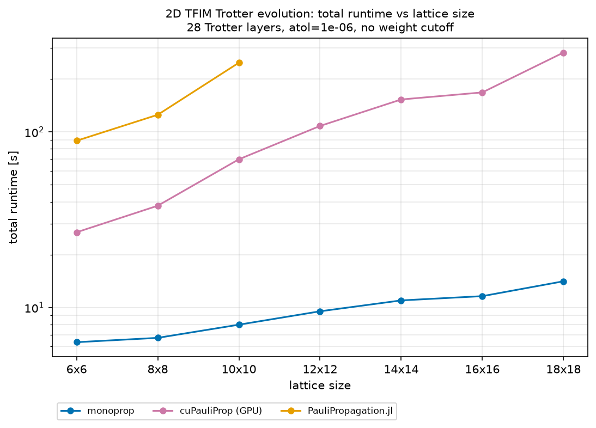
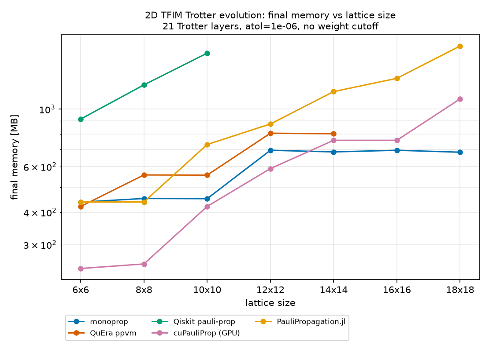
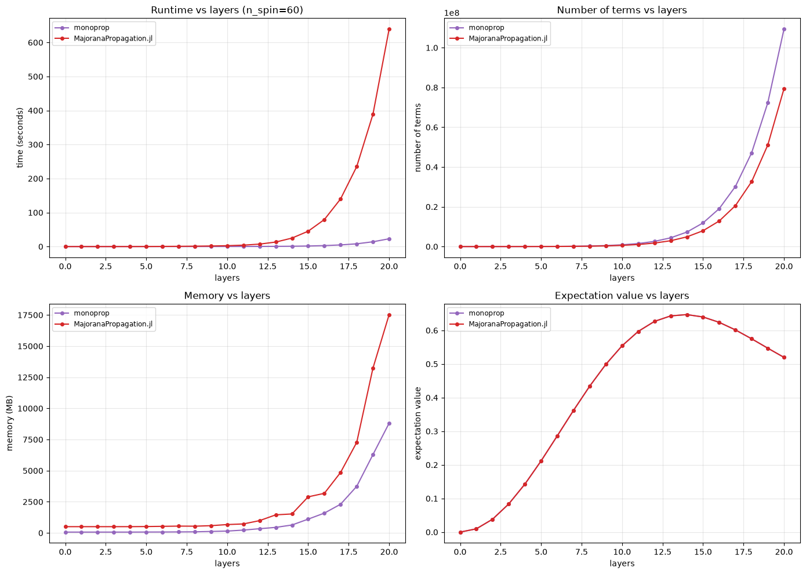

# monoprop
> because your operators deserve to propagate at escape velocity

[](https://docs.monoprop.algorithmiq.tech/)
[](https://github.com/Algorithmiq/monoprop/actions/workflows/test.yml)
[](https://codecov.io/gh/Algorithmiq/monoprop)
[](https://github.com/Algorithmiq/monoprop/actions/workflows/bench_main.yml)

`monoprop` is a high-performance C++ library with Python bindings for **Majorana and
Pauli propagation** — a backend for classically simulating and variationally
optimising quantum circuits. Rather than storing the full quantum state, it
expands an operator in the Majorana basis and propagates it through a circuit,
truncating terms that contribute little. It scales to large systems by partitioning
the operator across cores and across nodes with MPI.

> [!WARNING]
> This package is under active development. This project follows [Semantic Versioning](https://semver.org/). While in `0.x.y`, breaking changes may occur in minor releases.
> Pin your version if you depend on it. If you have feedback, please [open an issue](https://github.com/Algorithmiq/monoprop/issues/new).

## Benchmarks

Check out the comparison of `monoprop` against other open-source Pauli propagation engines:

<p align="center">
  
  
</p>

and against [`MajoranaPropagation.jl`](https://github.com/SparqleSim/MajoranaPropagation.jl):

<p align="center">
  
</p>

Head to our [benchmarks page](https://docs.monoprop.algorithmiq.tech/benchmarks) for more details.

Every commit on `main` also runs the internal benchmark suite, tracked over time
with [Bencher](https://bencher.dev/) to catch performance regressions.

📖 **Full documentation:** <https://docs.monoprop.algorithmiq.tech>

## Installation

```bash
pip install monoprop      # or: uv add monoprop
```

The prebuilt PyPI wheels are single-process (built **without** MPI). For multi-rank
runs, or to build the C++ library and executables, build from source (see below).

## Quick example

Back-propagate a Majorana observable through a one-gate circuit:

```python
from monoprop import MajoranaPropagator, ExpGate, Circuit, MajoranaOperator

# Observable m_0 m_1 m_2 m_4, evolved under one Majorana rotation exp(+i θ · M_γ),
# generated by M_γ = i*m_4 m_5.
observable = MajoranaOperator({(0, 1, 2, 4): 1.0}, num_modes=8)
gate = ExpGate(
    MajoranaOperator({(4, 5): 1j}, num_modes=8)
)  # Hermitian generator: weight-2 => imaginary coeff
circuit = Circuit(gates=[gate], system_size=8, parameters=[0.5])  # one angle per gate

mp = MajoranaPropagator.from_circuit(circuit, observable, cutoff=16)
print(mp.evolved_operator())  # the gate splits the monomial into two terms
```

Qubit (Pauli) operators are simulated with `PauliPropagator`. Here we back-propagate
`Z ⊗ Z` through one `exp(-i θ/2 · X_0)` rotation:

```python
from monoprop import PauliPropagator, ExpGate, Circuit, PauliOperator, Pauli

observable = PauliOperator(
    {"ZZ": 1.0}, num_qubits=2
)  # num_qubits lives on the observable
gate = ExpGate(PauliOperator({Pauli("X", 0): 1.0}, num_qubits=2))  # exp(+i θ · X_0)
circuit = Circuit(gates=[gate], system_size=2, parameters=[0.5])  # one angle per gate

mp = PauliPropagator.from_circuit(circuit, observable, cutoff=16)  # construct + evolve
print(mp.evolved_operator())  # the gate splits Z ⊗ Z into two terms
```

See the [getting-started guide](https://docs.monoprop.algorithmiq.tech/getting-started)
for fermionic operators and more.

## Building from source

A from-source build gives you the editable Python bindings and the C++ build tree
used for the library and unit tests. **MPI is off by default** in every build
path; enable it explicitly.

Python bindings (via [uv](https://github.com/astral-sh/uv)):

```bash
uv sync --all-extras -v
# with MPI:
uv sync --all-extras -v --config-settings=cmake.define.monoprop_ENABLE_MPI=ON
```

C++ unit-test build:

```bash
uv sync --all-extras -v
ctest --test-dir build/editable/Release
```

Every other build switch is a CMake option passed the same way — the 64-bit
`monoprop_WIDE_TERM_INDEX` build, and the `monoprop_CHECK_EXCHANGE_SYMMETRY`
diagnostic that audits the distributed exchange layout at the cost of an extra
collective. They are build-time rather than environment variables so that all
ranks of a job necessarily agree on them.

Full instructions — prerequisites, the build-option table, and running the example
executable — are in the [building guide](https://docs.monoprop.algorithmiq.tech/building).
In particular, from-source builds require `hwloc` and `pkg-config` so CMake can
locate `hwloc`.

## Running the tests

```bash
uv sync --all-groups --all-extras -v    # installs the workspace, incl. the bench tooling
uv run python -m pytest -m "not mpi"   # Python tests (serial)
just test-mpi                          # Python + C++ tests under MPI
just test-wide                         # Python + C++ unit tests with a 64-bit TermIndex
```

See the [testing guide](https://docs.monoprop.algorithmiq.tech/testing)
for the with/without-MPI details and the rank matrix.

## Repository layout

The repository is a [uv workspace](https://docs.astral.sh/uv/concepts/projects/workspaces/):

- the root is `monoprop` itself (`src/monoprop`, `cpp/`);
- `packages/monoprop-bench-tools` is the reusable benchmark harness — peak-memory
  measurement, the benchmarked model builders, and the result renderers — published
  separately so scripts and notebooks can depend on it without the repository;
- `packages/bench-third-party` holds the cross-engine comparison scripts. It has
  CUDA-specific pins, so it is a standalone uv project with its own lockfile;
- `benches/` is monoprop's own benchmark suite, which uses the tooling above.

## Development environment

The repository ships a [DevContainer](https://containers.dev/) that installs every
dependency (including the MPI toolchain and `pre-commit` hooks) and configures the
editor. To use it you need:

1. A working [Docker](https://docs.docker.com/get-docker/) installation
   (Docker Desktop on macOS/Windows, Docker Engine on Linux).
2. [Visual Studio Code](https://code.visualstudio.com/) with the
   [Dev Containers extension](https://marketplace.visualstudio.com/items?itemName=ms-vscode-remote.remote-containers).

Clone the repository and open the folder in VS Code; it will build the container
and run the setup automatically (this takes a few minutes the first time):

```bash
git clone https://github.com/Algorithmiq/monoprop.git
```

Without a DevContainer, install the prerequisites from the
[building guide](https://docs.monoprop.algorithmiq.tech/building#prerequisites)
by hand.

## Contributing

Please read [CONTRIBUTING.md](CONTRIBUTING.md) before opening a pull request.
All contributions require accepting the Individual CLA through CLA Assistant.
If you are contributing on behalf of your employer, contact
[cla@algorithmiq.fi](mailto:cla@algorithmiq.fi) to arrange a Corporate CLA.

## Documentation

The documentation is built with [Fumadocs](https://fumadocs.dev/) and hosted at
<https://docs.monoprop.algorithmiq.tech>. The Python API reference is generated from
docstrings ([griffe](https://mkdocstrings.github.io/griffe/)) and the tutorials are
executed from the notebooks in `docs/notebooks/`.  Building the documentation locally requires [npm](https://docs.npmjs.com/), the Node.js package manager. Once that is available, you can run:

```bash
just build-docs   # output: docs/out/
just serve-docs   # live-reloading dev server
just check-doc-links  # checks exported HTML links (including external URLs)
```

### Keeping documentation up to date

Any PR that changes behavior, public APIs, build/test commands, or repository paths
must update the relevant docs in the same change:

1. `AGENTS.md` for agent/developer workflow instructions.
2. `README.md` for top-level usage and contributor guidance.
3. `docs/` pages for user-facing and in-depth technical documentation.

## Citation

If you use `monoprop` in your research, please cite:

```bibtex
@ARTICLE{Miller2025-aj,
  title         = "{Simulation of Fermionic circuits using Majorana Propagation}",
  author        = "Miller, Aaron and Holmes, Zoë and Salehi, Özlem and
                   Chakraborty, Rahul and Nykänen, Anton and Zimborás, Zoltán
                   and Glos, Adam and García-Pérez, Guillermo",
  journal       = "arXiv [quant-ph]",
  year          =  2025,
  eprint        = "2503.18939",
  archivePrefix = "arXiv",
  primaryClass  = "quant-ph",
  url           = "https://arxiv.org/abs/2503.18939"
}
```

## License

`monoprop` is released under the [Apache License 2.0](LICENSE).
